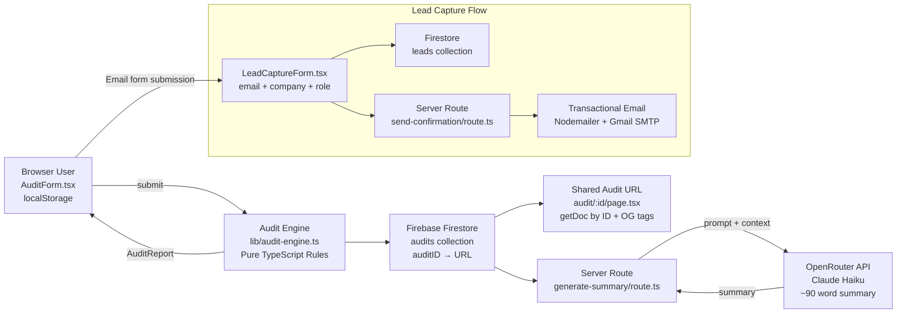

# ARCHITECTURE.md

## System Diagram



---

# Data Flow: Input → Audit Result

## 1. User fills the form

Each row follows this structure:

```ts
type AuditRow = {
  tool: string;
  plan: string;
  monthlySpend: number;
  seats: number;
  useCase: string;
};
```

Form state is persisted to `localStorage` on every change, making the UI reload-safe.

---

## 2. Audit engine execution

Submitting the form triggers:

```ts
generateAuditReport(rows);
```

The audit engine is:

- fully synchronous
- rule-based
- written in pure TypeScript
- independent of external APIs

Each tool is routed through dedicated logic such as:

- `auditCursor()`
- `auditClaude()`
- `auditChatGPT()`

Pricing data is loaded from:

```txt
data/pricing.ts
```

The output is an `AuditReport` containing:

- per-tool analysis
- recommendations
- estimated savings
- total optimization opportunities

---

## 3. Firestore persistence

The generated audit and original inputs are stored in:

```txt
audits/{id}
```

The Firestore document ID becomes the shareable URL:

```txt
/audit/{id}
```

---

## 4. AI summary generation

The frontend sends a POST request to:

```txt
/api/generate-summary
```

The request includes:

- highest-spend tool
- recommendation context
- audit insights

The server route calls OpenRouter using Claude Haiku to generate a concise audit summary.

If the AI request fails, the server returns a deterministic fallback summary so the UI never renders an empty state.

---

## 5. Client-side rendering

The frontend renders:

- total estimated savings
- per-tool breakdown
- AI-generated summary
- Credex upsell section
- shareable audit URL
- lead capture form

All rendering happens client-side from the in-memory `AuditReport`.

---

## 6. Lead capture flow

Lead information is stored in:

```txt
leads/{id}
```

Captured fields:

- email
- company
- role

A server route sends a transactional email using:

- Nodemailer
- Gmail SMTP

The email contains:

- audit link
- savings summary
- Credex CTA (for high-savings audits)

---

## 7. Shared audit page

Route:

```txt
audit/[id]/page.tsx
```

The page:

- fetches Firestore data by ID
- renders a public-safe audit report
- excludes sensitive lead information

Server-side metadata generates:

- OpenGraph tags
- Twitter Card previews

---

# Stack Choice

| Layer     | Choice                    | Why                                                                           |
| --------- | ------------------------- | ----------------------------------------------------------------------------- |
| Framework | Next.js 16 (App Router)   | Supports server components, metadata generation, and simple Vercel deployment |
| Language  | TypeScript                | Prevents pricing and audit logic mismatches with strong typing                |
| Styling   | Tailwind CSS v4           | Fast utility-first styling with minimal runtime overhead                      |
| Database  | Firebase Firestore        | Simple SDK and generous free tier for MVP development                         |
| AI        | OpenRouter → Claude Haiku | Cheap inference, provider flexibility, graceful fallback support              |
| Email     | Nodemailer + Gmail SMTP   | Simple transactional email setup without external vendor onboarding           |
| Testing   | Vitest                    | Fast TypeScript-native unit testing                                           |
| CI/CD     | GitHub Actions            | Automated linting, testing, and production build validation                   |

---

# What Would Change at 10k Audits/Day

## 1. Move from Firestore to Postgres

Firestore becomes expensive with high read volume.

A relational database such as:

- Supabase
- Neon Postgres

would provide:

- lower scaling cost
- relational querying
- analytics support
- better lead deduplication

---

## 2. Replace Gmail SMTP

Gmail has strict daily sending limits.

Production systems should migrate to:

- Resend
- Postmark

Benefits:

- improved deliverability
- webhook support
- scalable transactional email infrastructure

---

## 3. Add Rate Limiting

Current protection only uses a honeypot field.

At scale, APIs require:

- IP throttling
- abuse prevention
- distributed rate limiting

Recommended solution:

```txt
Upstash Redis
```

---

## 4. Queue AI Summary Generation

Synchronous AI requests become a bottleneck at high concurrency.

Summary generation should move into:

- BullMQ
- Trigger.dev
- background worker queues

Improved flow:

1. audit completes instantly
2. summary job is queued
3. UI streams summary asynchronously

---

## 5. Dynamic OG Image Generation

Instead of static metadata-only previews, generate dynamic OpenGraph images using:

- Vercel OG
- edge rendering
- CDN caching

Benefits:

- better social previews
- branded share cards
- improved click-through rates
