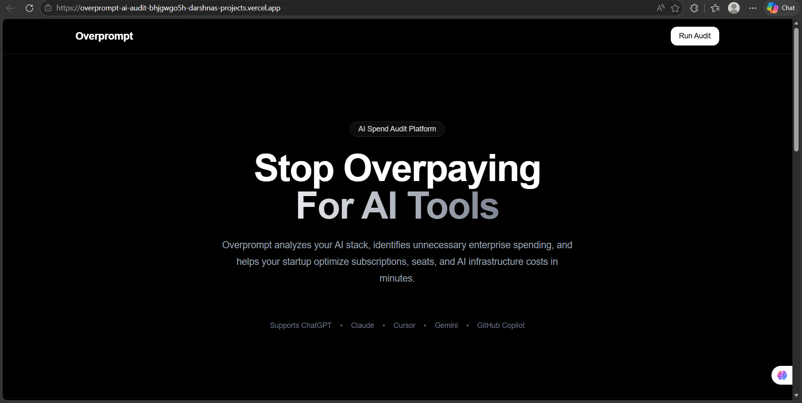
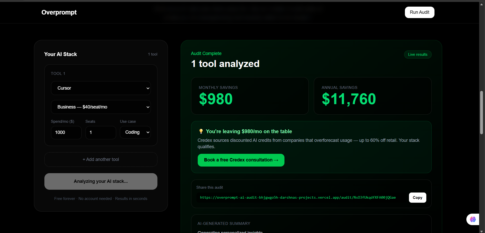
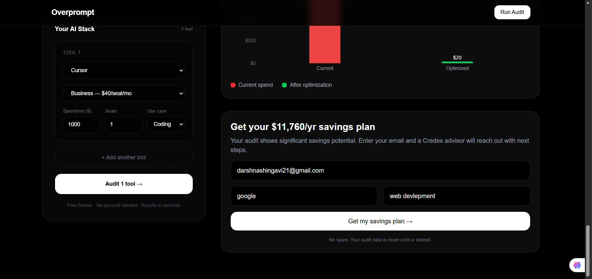
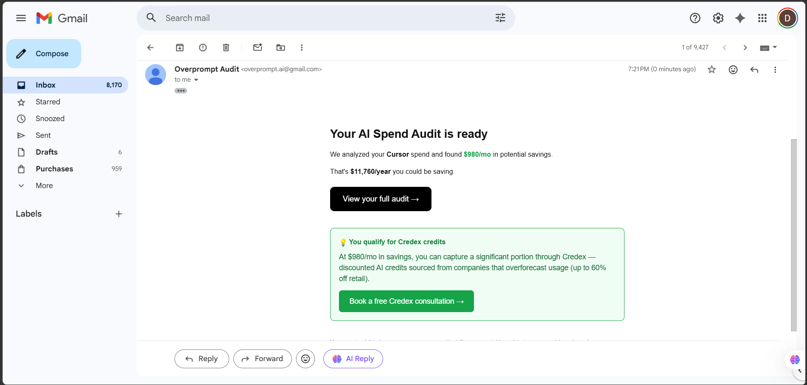
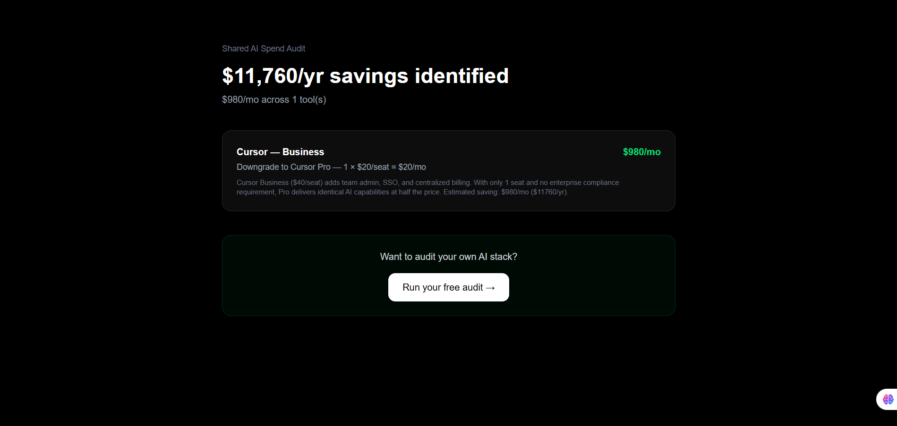

# Overprompt — AI Spend Audit for Startups

Overprompt is a free AI tool spend auditor for startup founders and engineering managers. You input your AI subscriptions, plans, seat counts, and use cases — it outputs exactly where you're overspending, what to switch to, and how much you'd save monthly and annually. High-savings audits surface Credex as the path to capture even more of those savings.

## Live URL

> https://overprompt-ai-audit.vercel.app/

## Screenshots

<table>
  <tr>
    <td align="center">
      <br/>
      <b>Main Screen</b>
    </td>
    <td align="center">
      <br/>
      <b>Audit Dashboard</b>
    </td>
  </tr>

  <tr>
    <td align="center">
      <br/>
      <b>AI Summary</b>
    </td>
    <td align="center">
      <br/>
      <b>Send Mail</b>
    </td>
  </tr>

  <tr>
    <td align="center">
      <br/>
      <b>Inbox Mail</b>
    </td>
    <td align="center">
      <br/>
      <b>Share URL</b>
    </td>
  </tr>
</table>

## Quick Start

### Prerequisites

- Node.js
- A Firebase project (Firestore enabled)
- An OpenRouter API key (or Anthropic API key — swap in `route.ts`)
- A Gmail account with an App Password (for transactional email)

### Install & Run Locally

```bash
git clone https://github.com/darshna21-bit/overprompt-ai-audit.git
cd overprompt-ai-audit
npm install
cp .env.example .env.local   # fill in your keys
npm run dev
```

Open [http://localhost:3000](http://localhost:3000).

### Environment Variables

```
NEXT_PUBLIC_FIREBASE_API_KEY=
NEXT_PUBLIC_FIREBASE_AUTH_DOMAIN=
NEXT_PUBLIC_FIREBASE_PROJECT_ID=
NEXT_PUBLIC_FIREBASE_STORAGE_BUCKET=
NEXT_PUBLIC_FIREBASE_MESSAGING_SENDER_ID=
NEXT_PUBLIC_FIREBASE_APP_ID=
OPENROUTER_API_KEY=
NEXT_PUBLIC_APP_URL=https://your-deployed-url.vercel.app
GMAIL_USER=
GMAIL_APP_PASSWORD=
```

### Deploy

Recommended: Vercel (zero-config for Next.js).

```bash
vercel --prod
```

Add all env variables under **Settings → Environment Variables** in the Vercel dashboard.

---

## Decisions

Five trade-offs made during the build and why:

1. **Firebase Firestore over Supabase for storage.** Firestore's client SDK lets the frontend save an audit and retrieve a shareable URL without a custom backend route — one fewer API surface to maintain. The trade-off is vendor lock-in and Firestore's less-friendly pricing at scale; Supabase Postgres would be the right call if this needed relational queries (e.g. "all audits for this email domain"). For an MVP lead-gen tool, Firestore wins on speed.

2. **OpenRouter instead of direct Anthropic API for the AI summary.** OpenRouter lets me swap models without a code change (just update the model string). It adds a thin intermediary, which means latency goes up ~100ms and I take a small markup. Acceptable for a 90-word summary that users wait on anyway. If Credex deploys this, switching to direct Anthropic API cuts cost and latency.

3. **Hardcoded rules for the audit engine, AI only for the summary.** The assignment explicitly calls this out as the right call, and it is. Rule-based math is auditable, testable, and explainable to a finance person. LLM savings math would be wrong 5% of the time and impossible to debug. AI earns its place on the summary paragraph — natural language, not arithmetic.

4. **Honeypot over hCaptcha for abuse protection.** hCaptcha adds an extra user interaction (solve a puzzle before seeing the audit result) which directly hurts conversion. Honeypot is invisible to real users and catches most bots. Rate limiting on the lead capture API route covers the rest. Caveat: a determined attacker can bypass honeypot; at MVP scale, this is acceptable.

5. **Next.js App Router over Pages Router.** App Router's server components make it straightforward to do server-side OG tag generation for the shareable audit URL, which is a hard requirement. The trade-off is that App Router is newer, docs are thinner, and some libraries (older Firebase SDK patterns) need client-component wrappers. Worth it for OG support.
